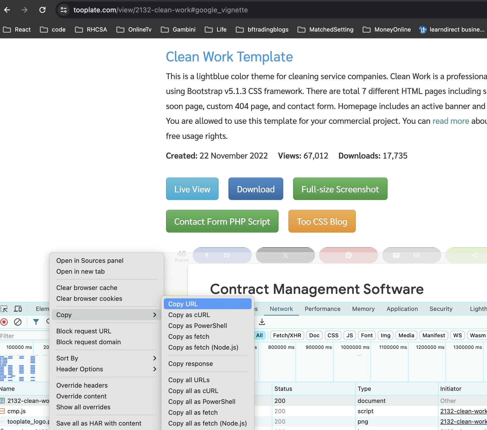
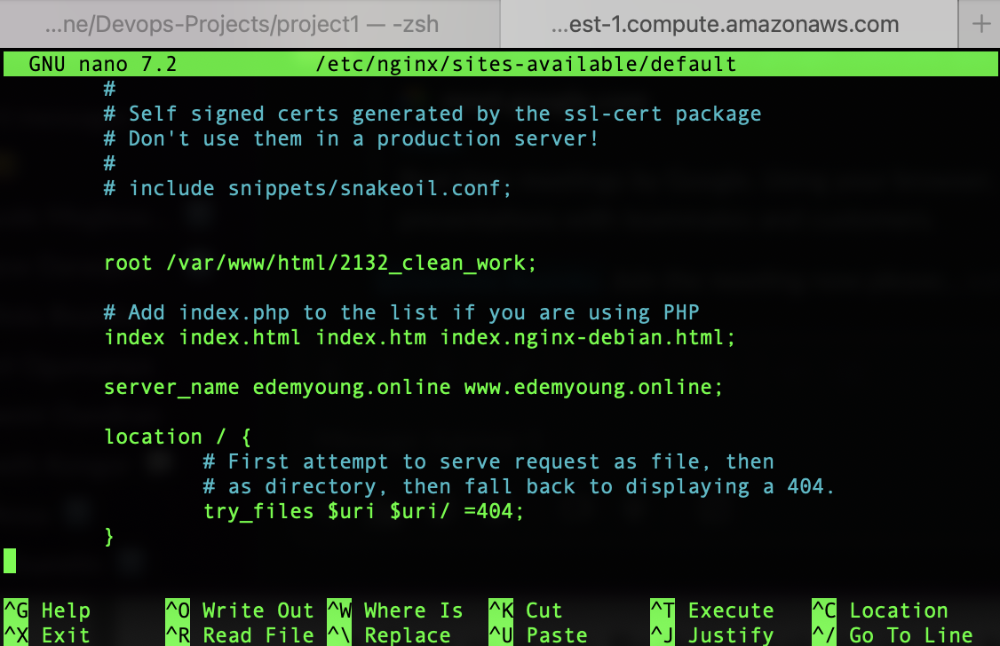
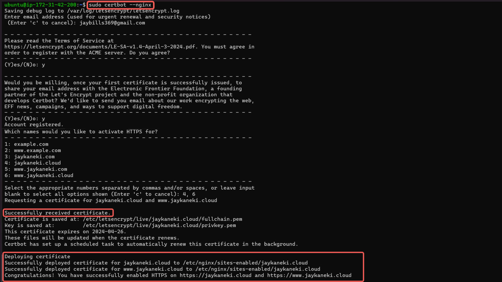

# Setup a Static Website Using Nginx in aws cloud

We will be building as well as documenting the following:

- **Building with Nginx**
- **Connecting with Route53**
- **Securing with Certbot**

## Project Tasks

<table>
<tr>
<td width="20%">S/N</td>
<td width="80%">Project Tasks</td>
</tr>
<tr>
<td>1</td>
<td>Buy a domain name from a domain Registrar</td>
</tr>
<tr>
<td>2</td>
<td>Spin up an Ubuntu server & assign an elastic IP to it</td>
</tr>
<tr>
<td>3</td>
<td>SSH into the server and install Nginx</td>
</tr>
<tr>
<td>4</td>
<td>Download freely HTML website files(too plate) or use your personal code</td>
</tr>
<tr>
<td>5</td>
<td>Copy the website files to the Nginx website directory</td>
</tr>
<tr>
<td>6</td>
<td>Validate the website using the server IP address</td>
</tr>
<tr>
<td>7</td>
<td>In Route53, create an A record and add the Elastic IP</td>
</tr>
<tr>
<td>8</td>
<td>Using DNS verify the website setup</td>
</tr>
<tr>
<td>9</td>
<td>Install certbot and Request For an SSL/TLS Certificate</td>
</tr>
<tr>
<td>10</td>
<td>Validate the website SSL using the OpenSSL utility</td>
</tr>
</table>

## Checklst

- [x] _Task 1_: Buy a domain name from a domain Registrar.
- [x] _Task 2_: Spin up a Ubuntu server & assign an elastic IP to it.
- [x] _Task 3_: SSH into the server and install Nginx.
- [x] _Task 4_: Find freely available HTML website files.
- [x] _Task 5_: Download and unzip the website files to the Nginx website directory.
- [x] _Task 6_: Validate the website using the server IP address.
- [x] _Task 7_: In Route53, create an A record and add the Elastic IP.
- [x] _Task 8_: Using DNS verify the website setup.
- [x] _Task 9_: Install certbot and Request For an SSL/TLS Certificate.
- [x] _Task 10_: Validate the website SSL using the OpenSSL utility.

## Documentation

### Create An Ubuntu Server

- Locate and click on EC2 within the AWS management console.
- Click on Launch Instance
- Name your instance and select the Ubuntu AMI.
- Click the Create new key pair button to generate a key pair for secure connection to your instance.
- Enter a Key pair name and click on Create key pair.
- Enable SSH, HTTP, and HTTPS access(under network settings), then proceed to click Launch instance.
- Click on View all instances.
- Click on the created instance.
- Click on the Connect button on your summary page
- Copy the command provided under the `SSH client` tab
- Open terminal in location with download pem key and paste && run your command
- Select `Elastic IPs` under the Network & Security menu located left of your screen (might need to expand to see all options)
- Click Allocate Elastic IP A
  address button
- Leave default settings and click Allocate button at bottom of page
- Click Associate this Elastic IP Address to link this ip to your ec2 instance
- Select your instance name from the instance dropdown and click Associate button
- Go back to your ec2 instance and click connect and copy and paste the ssh code to your terminal which should opened where you pem key is
- Update,Upgrade and Install nginx `sudo apt update` , `sudo apt upgrade` , `sudo apt install nginx`
- Start your nginx server `sudo systemctl start nginx`
- Enable your nginx server `sudo systemctl enable nginx` and confirm it's running `sudo systemctl status nginx`
- Copy your IPv4 address from your ec2 instance dashboard and paste the address into your web browser (you should see the default nginx startUp page)
- Download website template from a site like https://www.tooplate.com/free-templates
- When you have selected your preferred site, right click and select inspect to open the dev console,select the network tab,click download on the page and when the site zip file gets downloaded and seen in the console of your network tab,right click and copy the url as shown below
  
- The curl command is a utility for making HTTP requests via the command line. Here, it's utilized to retrieve a file from a specified URL. The -o flag designates the output file or destination. In this instance, it signifies that the downloaded file, named "2137_barista_cafe.zip", should be stored in the "/var/www/html/" directory. The URL https://www.tooplate.com/zip-templates/2137_barista_cafe.zip is the source for downloading the file. Make sure to replace it with the URL of your own website template. Curl will retrieve the content located at this URL.
- Install your unzip tool `sudo apt install unzip` and run it within the location where your zipped site content is located using `sudo unzip <website template name>`
- Update your nginx configuration `sudo nano /etc/nginx/sites-available/default` by updating the root to point to the directory where your downloaded html files are stored
  ![picture showing how to update nginx root direcory]

  ### Create An A Record

  To make your website accessible via your domain name rather than the IP address, you'll need to set up a DNS record. I did this by buying my domain from a domain registrar eg Namecheap,GoDaddy and then moved hosting to AWS Route 53, where I set up an A record.

  - Find Route53 service in your aws console and click get started
  - Select create trusted zones
  - Enter your Domain name①, choose Public hosted zone② and then click on Create hosted zone③.
  - Select the created hosted zone① and copy the assigned Values②
  - Go back to your domain registrar,click manage beside the domain you plan on using and select Custom DNS within the NAMESERVERS section
  - Paste the values you copied from Route 53 into the appropriate fields, then click the checkmark symbol to save the changes.
  - Head back to your AWS console and click on Create record.
  - Paste your Elastic IP address in the values textbox and then click on Create records
  - Your A record has been successfully created
  - Click on create record again, to create the record for your sub domain.
  - Input the Record name(www➀), paste your IP address➁, and then click on Create records➂
  - Open your terminal and run sudo nano /etc/nginx/sites-available/default to edit your settings. Enter your domain and subdomain names, then save the changes.
  - Restart your nginx server by running the sudo systemctl restart nginx command
  - Go to your domain name in a web browser to verify that your website is accessible

  ### Install certbot and Request For an SSL/TLS Certificate

  - Install certbot by executing the following commands: `sudo apt update` , `sudo apt install certbot python3-certbot-nginx`
  - Execute the `sudo certbot --nginx` command to request your certificate. Follow the instructions provided by certbot and select the domain name for which you would like to activate HTTPS.
    
  - Verify the website's SSL using the OpenSSL utility with the command: `openssl s_client -connect edemyoung.online:443`

  
