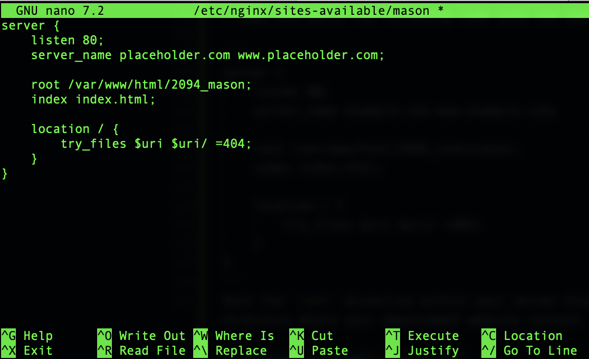

# Setup Multiple Static Websites on a Single Server Using Nginx Virtual Hosts

In this project, we will learn the concept of subdomains and hosting multiple websites on a single server using Nginx Virtual Host configuration.

## Key Concepts Covered

- AWS (EC2 and Route 53)
- EC2
- Linux(Ubuntu)
- Nginx
- DNS
- Subdomains
- SSL (certbot)
- OpenSSL command

## Project Tasks

<table>
<tr>
<td width="20%">S/N</td>
<td width="80%">Project Tasks</td>
</tr>
<tr>
<td>1</td>
<td>Install and configure Nginx on a server</td>
</tr>
<tr>
<td>2</td>
<td>Create two website directories with two different website templates.</td>
</tr>
<tr>
<td>3</td>
<td>Create two subdomains</td>
</tr>
<tr>
<td>4</td>
<td>Add the IP of the server as A record to the two subdomains.</td>
</tr>
<tr>
<td>5</td>
<td>Configure the Virtual host to point two subdomains to two different website directories.</td>
</tr>
<tr>
<td>6</td>
<td>Validate the setup by accessing the subdomains.</td>
</tr>
<tr>
<td>7</td>
<td>Create a certbot SSL certificate for the root Domain.</td>
</tr>
<tr>
<td>8</td>
<td>Configure certbot on Nginx for two websites.</td>
</tr>
<tr>
<td>9</td>
<td>Validate the subdomain websites’ SSL using OpenSSL utility.</td>
</tr>
</table>

## Checklist

- [x] _Task 1_: Spin up a Ubuntu server & assign an elastic IP to it.
- [x] _Task 2_: SSH into the server and install and configure Nignx on a server.
- [x] _Task 3_: Create two website directories with two different website templates.
- [x] _Task 4_: Create two subdomains
- [x] _Task 5_: Add the IP of the server as A record to the two subdomains.
- [x] _Task 6_: Configure the Virtual host to point two subdomains to two different website directories.
- [x] _Task 7_: Validate the setup by accessing the subdomains.
- [x] _Task 8_: Create a certbot SSL certificate for the root Domain.
- [x] _Task 9_: Configure certbot on Nginx for the two websites.
- [x] _Task 10_: Validate the subdomain websites’ SSL using OpenSSL utility.

## Documentation

<strong> Spin up a Ubuntu server & assign an elastic IP to it. </strong>


<strong>SSH into the server and install and configure Nignx on a server.</strong>

- run
  `sudo apt update` `sudo apt upgrade` `sudo apt install nginx`
- Start your Nginx server by running the `sudo systemctl start nginx` command, enable it to start on boot by executing sudo `systemctl enable nginx`, and then confirm if it's running with the `sudo systemctl status nginx` command.

  

- Download your website template from your preferred website by navigating to the website, locating the template you want.


- Install unzip `sudo apt install unzip`
- run `sudo curl -o /var/www/html/2096_individual.zip https://www.tooplate.com/zip-templates/2096_individual.zip && sudo unzip -d /var/www/html/ /var/www/html/2096_individual.zip && sudo rm -f /var/www/html/2096_individual.zip `
  

- Download the 2nd website template by running the following command:
  `sudo curl -o /var/www/html/2094_mason.zip https://www.tooplate.com/zip-templates/2094_mason.zip && sudo unzip -d /var/www/html/ /var/www/html/2094_mason.zip && sudo rm -f /var/www/html/2094_mason.zip`


- To set up your website's configuration, start by creating a new file in the Nginx sites-available directory. Use the following command to open a blank file in a text editor: `sudo nano /etc/nginx/sites-available/individual`


- Copy and paste the following code into the open text editor.

```
server {
    listen 80;
    server_name example.com www.example.com;

    root /var/www/html/2096_individual;
    index index.html;

    location / {
        try_files $uri $uri/ =404;
    }
}
```

Edit the `root` directive within your server block to point to the directory where your downloaded website content is stored.


Configure your second website by creating a new file in the Nginx sites-available directory with the following command: `sudo nano /etc/nginx/sites-available/mason`.

Copy and paste the following code into the open text editor.

```
server {
    listen 80;
    server_name placeholder.com www.placeholder.com;

    root /var/www/html/2094_mason;
    index index.html;

    location / {
        try_files $uri $uri/ =404;
    }
}
```

Edit the `root` directive within your server block to point to the directory where your downloaded website content is stored.



- Create a symbolic link for both websites by running the following command. `sudo ln -s /etc/nginx/sites-available/individual /etc/nginx/sites-enabled/` `sudo ln -s /etc/nginx/sites-available/mason /etc/nginx/sites-enabled/`


- Run the `sudo nginx -t` command to check the syntax of the Nginx configuration file.

- Delete the default files in the sites-available and sites-enabled directories by executing the following commands:

```
sudo rm /etc/nginx/sites-available/default
sudo rm /etc/nginx/sites-enabled/default
```

- Restart the Nginx server by executing the following command: `sudo systemctl restart nginx`.

## Create An A Record

To make your website accessible via your domain name rather than the IP address, you'll need to set up a DNS record. I did this by buying my domain from Namecheap and then moving hosting to AWS Route 53, where I set up an A record.

> [Note]
> Visit [Project1](../project1/README.md) for instructions on how to create a hosted zone.

- In route 53, select the domain name and click on Create record.
- Paste your IP address① and then click on Create records②.
- Click on Create record again, to create the record for your sub domain.
- Input the Record name①, paste your IP address② and then click on Create records③.
- Repeat the same process while creating your second subdomain record, and confirm that they both exist in the records list.


- Open your terminal and run `sudo nano /etc/nginx/sites-available/individual` to edit your settings. Enter the name of your domain and then save your settings.


- Open your terminal and run `sudo nano /etc/nginx/sites-available/mason` to edit your settings. Enter the name of your domain and then save your settings.


- Restart your nginx server by running the `sudo systemctl restart nginx` command.

- Go to your domain name in a web browser to verify that your website is accessible.
  
