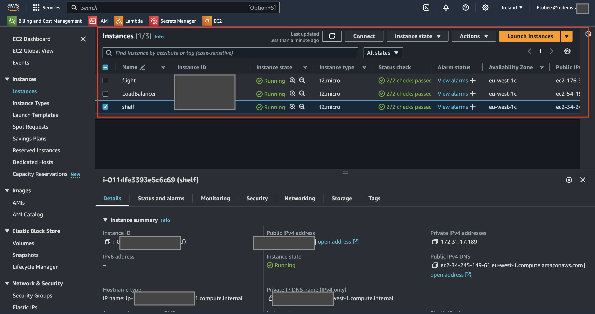
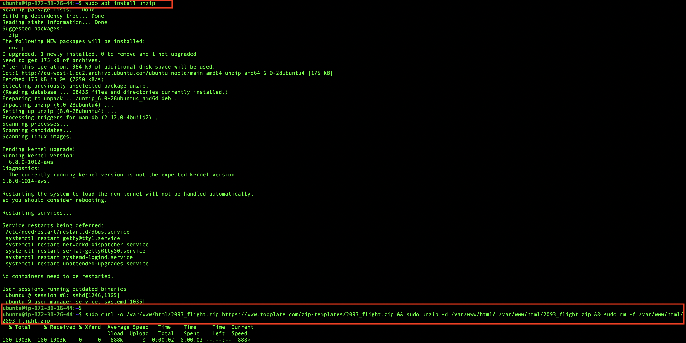
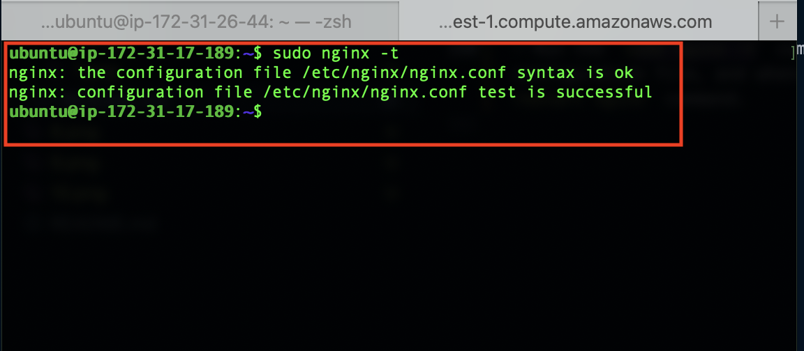
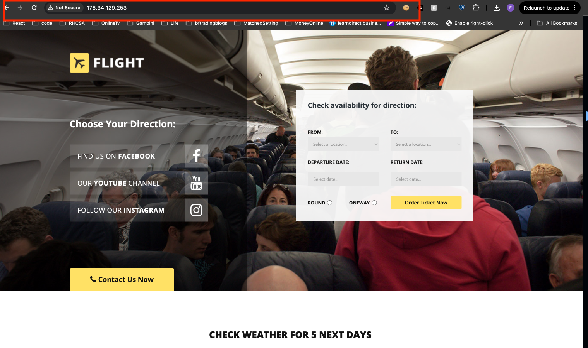
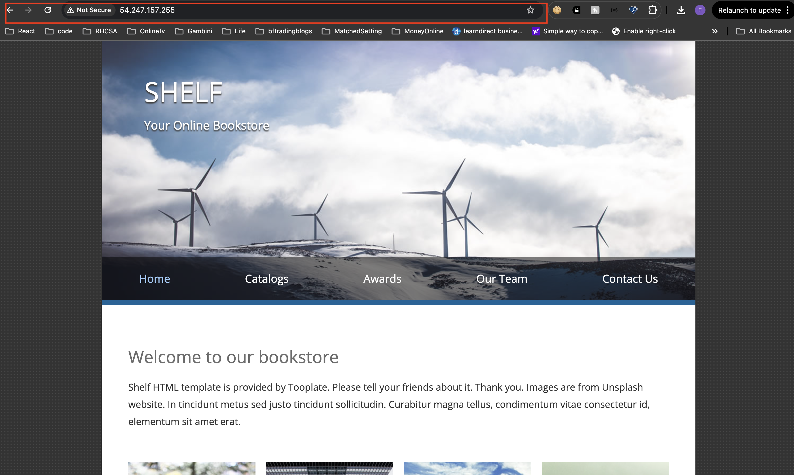
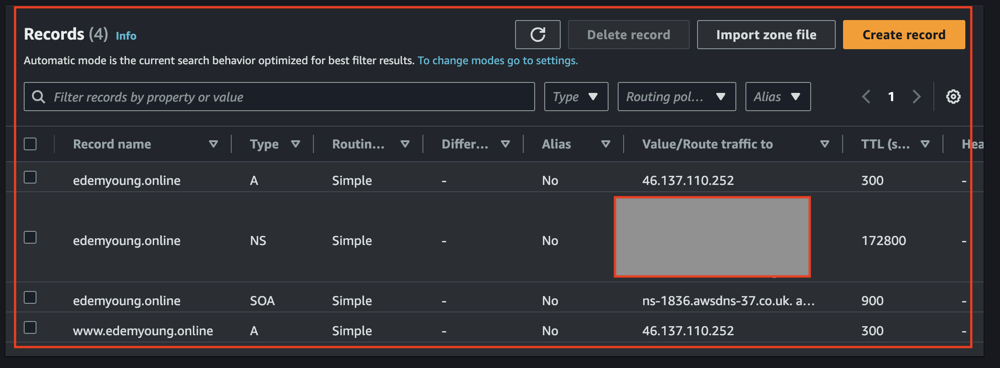
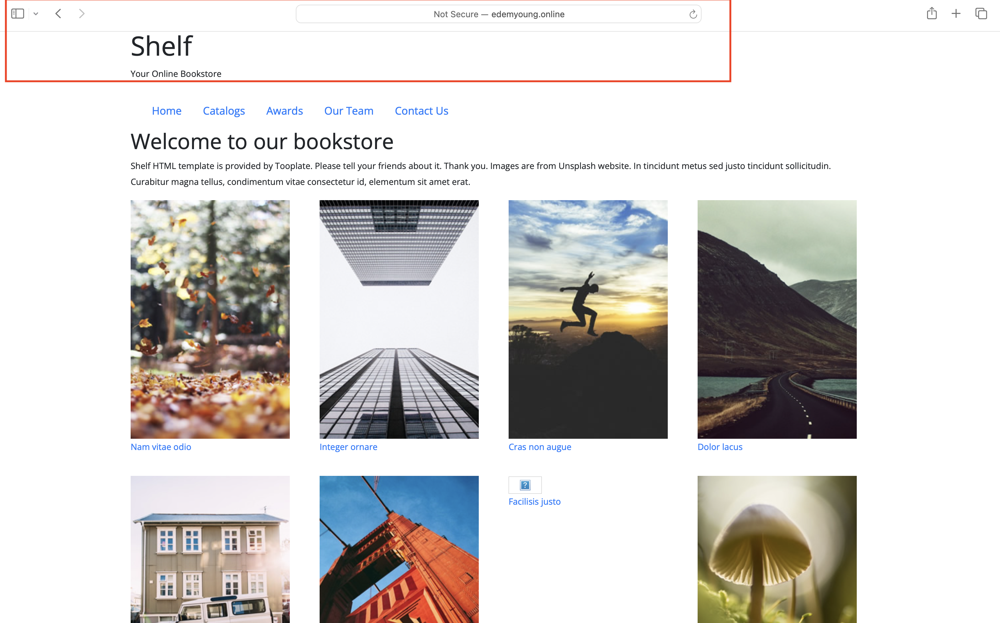
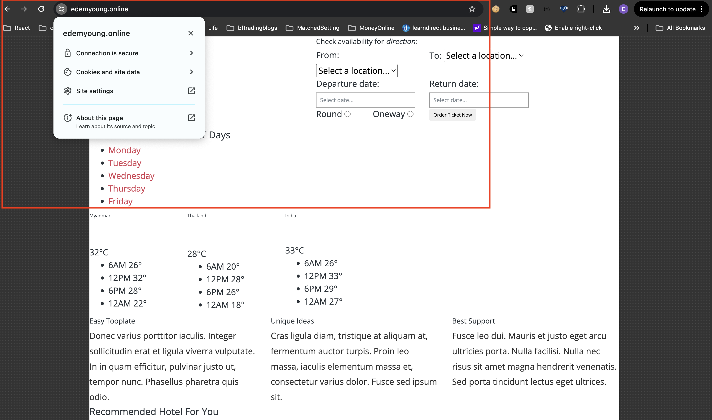

<u>

# Project 3 : Setup Load Balancing for Static Website Using Nignx

</u>
This project aims to teach Layer 7 load balancing and load balancing algorithms using Nginx as a Load Balancer.

<u>

## Type of Load Balancer

</u>
This is a reverse proxy load balancer configuration in Nginx, where Nginx acts as an intermediary for requests from clients seeking resources from the servers behind it. It's capable of distributing traffic across the servers listed in the upstream block.
<u>

## Characteristics

</u>

- HTTP Load Balancing: This configuration balances HTTP requests.
- Round Robin: By default, Nginx uses a round-robin algorithm to distribute traffic evenly among the servers unless otherwise specified.
- Scalability: You can add more servers in the upstream block to scale out your application.

> [!NOTE]
> If you need more advanced load balancing methods (e.g., least connections, IP hash), you can configure Nginx to use those as well.

<table>
<tr>
<td width="20%">S/N</td>
<td width="80%">Project Tasks</td>
</tr>
<tr>
<td>1</td>
<td>Deploy three servers</td>
</tr>
<tr>
<td>2</td>
<td>Set up static websites on two servers using Nginx.</td>
</tr>
<tr>
<td>3</td>
<td>Use two separate HTML files with distinct content. Deploy one file to each server's index.html location.</td>
</tr>
<tr>
<td>4</td>
<td>Set up Nginx on the third server. It will act as a load balancer.</td>
</tr>
<tr>
<td>5</td>
<td>Configure Nginx to load and balance traffic between two static websites.</td>
</tr>
<tr>
<td>6</td>
<td>Add the Nginx Load balancer IP to the DNS A record.</td>
</tr>
<tr>
<td>7</td>
<td>Try accessing the website. Every time you reload the website you should see a different index.html.</td>
</tr>
</table>
<u>

## Key Concepts Covered

</u>

- AWS (EC2 and Route 53)
- EC2
- Linux(Ubuntu)
- Nginx
- DNS
- Load balancing
- SSL (certbot)
- OpenSSL command
  <u>

## Documentation

</u>

- Spin up your 3 ubuntu servers. Ensure you clearly name them so you don't make mistakes.
  

  ## Install Nginx and Setup Your Website

  > [!NOTE]
  > Install Nginx on both web server terminals. These are the terminals you're using to manage the servers hosting the two distinct website contents that the load balancer will distribute traffic to.

  

- Download your website template from your preferred website by navigating to the website, locating the template you want.
- Right click and select Inspect from the drop down menu.
- On the network tab, click the download button and copy the download url
  

- Visit your instances IP address in a web browser to view the default Nginx startup page.

- Execute sudo apt install unzip to install the unzip tool and run the following command to download and unzip your website files `sudo curl -o /var/www/html/2135_mini_finance.zip https://www.tooplate.com/zip-templates/2135_mini_finance.zip && sudo unzip -d /var/www/html/ /var/www/html/2135_mini_finance.zip && sudo rm -f /var/www/html/2135_mini_finance.zip.`



- To set up your website's configuration, start by creating a new file in the Nginx sites-available directory. Use the following command to open a blank file in a text editor: `sudo nano /etc/nginx/sites-available/flight`.

- Copy and paste the following code into the open text editor.

```
server {
    listen 80;
    server_name example.com www.example.com;

    root /var/www/html/example.com;
    index index.html;

    location / {
        try_files $uri $uri/ =404;
    }
}
```

- Edit the root directive within your server block to point to the directory where your downloaded website content is stored.


- Create a symbolic link for both websites by running the following command. `sudo ln -s /etc/nginx/sites-available/flight /etc/nginx/sites-enabled/`


- Run the `sudo nginx -t` command to check the syntax of the Nginx configuration file, and when successful run the `sudo systemctl restart nginx` command


- Repeat the process for the second website.


- To set up your website's configuration, start by creating a new file in the Nginx sites-available directory. Use the following command to open a blank file in a text editor: sudo `nano /etc/nginx/sites-available/shelf`.

- Copy and paste the following code into the open text editor.

```
server {
    listen 80;
    server_name placeholder.com www.placeholder.com;

    root /var/www/html/placeholder.com;
    index index.html;

    location / {
        try_files $uri $uri/ =404;
    }
}
```

Edit the `root` directive within your server block to point to the directory where your downloaded website content is stored


- Create a symbolic link for both websites by running the following command. `sudo ln -s /etc/nginx/sites-available/shelf /etc/nginx/sites-enabled/`


- Run the `sudo nginx -t` command to check the syntax of the Nginx configuration file, and when successful run the `sudo systemctl restart nginx` command.



> [!NOTE]
> On your first server, run `sudo rm /etc/nginx/sites-enabled/default`, and on your second server, run `sudo rm /etc/nginx/sites-enabled/default`. This will delete the default site-enabled folders and enable Nginx to serve content from your specified website directories. If you don't delete these default folders, you'll continue to see the default Nginx page.


- Run the `sudo systemctl restart nginx` command to restart your server
- Check both IP addresses to confirm your website is up and running




## Configure your Load balancer

- Install Nginx on the server you want to use as a load balancer, and execute `sudo systemctl status nginx` to ensure it's running

- Execute sudo nano /etc/nginx/nginx.conf to edit your Nginx configuration file.

- Add the following within the http block

```
    upstream edemyoung {
    server 1;
    server 2;
    # Add more servers as needed
}

server {
    listen 80;
    server_name edemyoung.online www.edemyoung.online;

    location / {
        proxy_pass http://edemyoung;
    }
}

```


> [!NOTE]
> Replace the necessary placeholders as shown in the picture above. Substitute <server 1> and <server 2> with the actual private IP addresses of your servers. Also, replace <your domain> www.<your domain> with your root domain and subdomain name, and update proxy_pass and the other relevant fields accordingly.

- Run `sudo nginx -t` to check for syntax error


- Apply the changes by restarting Nginx: `sudo systemctl restart nginx`

## Create An A Record

- To make your website accessible via your domain name rather than the IP address, you'll need to set up a DNS record. I did this by buying my domain from Namecheap and then moving hosting to AWS Route 53, where I set up an A record.

- Point your domain's A records to the IP address of your Nginx load balancer server.

- In route 53, select the domain name and click on Create record.
- Paste your IP address➀ and then click on Create records➁ to create the root domain.
- Click on create record again, to create the record for your sub domain.

- Paste your IP address➀, input the Record name(www➁) and then click on Create records➂.


-Go to the terminal you used in setting your first website and run `sudo nano /etc/nginx/sites-available/flight` to edit your settings. Enter the name of your domain and then save your settings


- Go to the terminal you used in setting your second website and run `sudo nano /etc/nginx/sites-available/shelf` to edit your settings. Enter the name of your domain and then save your settings
  
- Restart your nginx server by running the `sudo systemctl restart nginx` command.
- Go to your domain name in a web browser to verify that your website is accessible.
  
  
  

## Install certbot and Request For an SSL/TLS Certificate

- Install certbot by executing the following commands: `sudo apt update` `sudo apt install python3-certbot-nginx`

- Execute the `sudo certbot --nginx` command to request your certificate. Follow the instructions provided by certbot and select the domain name for which you would like to activate HTTPS.
  
- Access your website to verify that Certbot has successfully enabled HTTPS.




- It is recommended to renew your LetsEncrypt certificate at least every 60 days or more frequently. You can test renewal command in dry-run mode: `sudo certbot renew --dry-run`


