<u>

# Setup WordPress Website Using LAMP Stack

</u>

Setting up a WordPress website using the LAMP stack (Linux, Apache, MySQL, PHP) is a powerful way to create a robust and scalable web presence. This project will guide you through each step of the process, from setting up your server environment to installing WordPress and configuring it for optimal performance. Whether you're a seasoned developer or a beginner, this tutorial will provide you with the knowledge and skills needed to deploy a fully functional WordPress site. By the end of this guide, you'll have a solid understanding of how to leverage the LAMP stack to build and manage your own WordPress website, ensuring a secure, efficient, and customizable platform for your content.

<strong>Key Features:</strong>

- Step-by-step instructions for installing and configuring LAMP components.
- Secure database creation for your WordPress website.
- User-friendly guide for completing the WordPress installation process.

<strong>Benefits:</strong>

- Gain independence by managing your own WordPress website.
- Understand the core technologies behind WordPress.
- Customize your website to your exact needs.
- Embrace the flexibility and power of WordPress.

<table>

<tr>
<td width="20%">S/N</td>
<td width="80%">Project Tasks</td>
</tr>
<tr>
<td>1</td>
<td>Deploy an Ubuntu Server</td>
</tr>
<tr>
<td>2</td>
<td>Set up your LAMP stack on the server</td>
</tr>
<tr>
<td>3</td>
<td>Configure the wordpress Application</td>
</tr>
<tr>
<td>4</td>
<td>Map the IP address to the DNS A record</td>
</tr>
<tr>
<td>5</td>
<td>Validate the WordPress website setup by accessing the web address.</td>
</tr>
</table>

<u>

## Key Concepts Covered

</u>

- AWS (EC2 and Route 53)
- Linux(Ubuntu)
- Apache
- MySQL
- PHP
- Wordpress
- DNS
- SSL (certbot)
- OpenSSL command

<u>

## Documentation

</u>
- Create an EC2 ubuntu instance
- We will set an inbound rule for MYSQL in your security group by clicking on security and selecting the Security group.


- Edit inbound rules

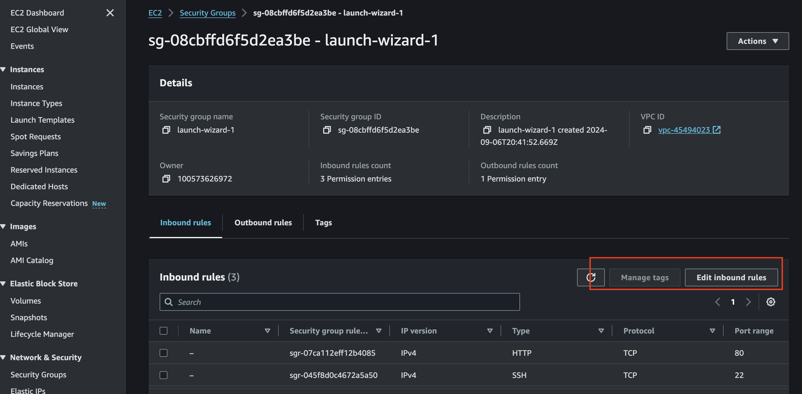

- Add rule

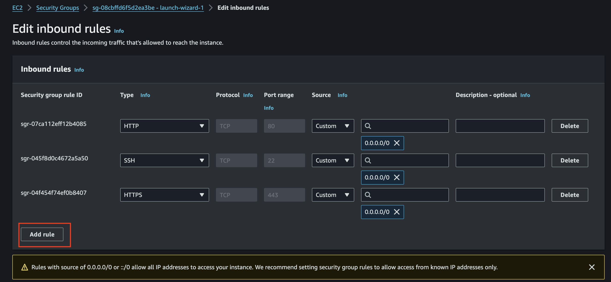

- Click on Custom TCP and select MySQL/Aurora.

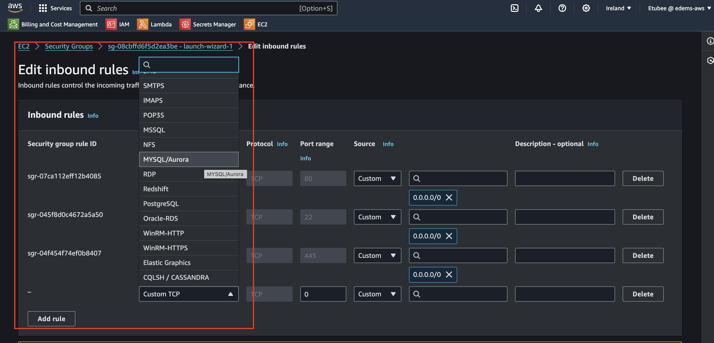

- Enter the IP address you want to allow access and click Save rules.


- SSH into your ubuntu server via your terminal.


---

## Install Apache

run `sudo apt update`


run `sudo apt install apache2`


- Enable Apache to start on boot by executing `sudo systemctl enable apache2` then verify its status with the `sudo systemctl status apache2` command


- Check if our server is running and accessible both locally and from the Internet by executing the following command: `curl http://localhost:80`


- Paste your instance IPv4 address into your broswer address bar and if installation was successful you should see the below page


## Install MYSQL

- run the command sudo apt install mysql-server


- Log in to the MySQL console by typing: `sudo mysql`

> [!NOTE]
> It's recommended that you run a security script included with MySQL to enhance security. Before running the script, set a password for the root user using the default authentication method mysql_native_password. For this project, we'll define the password as "pass", but you can choose any password you prefer.

- Run the following command to set the password for the root user with the MySQL native password authentication method: `ALTER USER 'root'@'localhost' IDENTIFIED WITH mysql_native_password BY '*****';`. Exit the MySQL shell when you're done by typing `exit`.

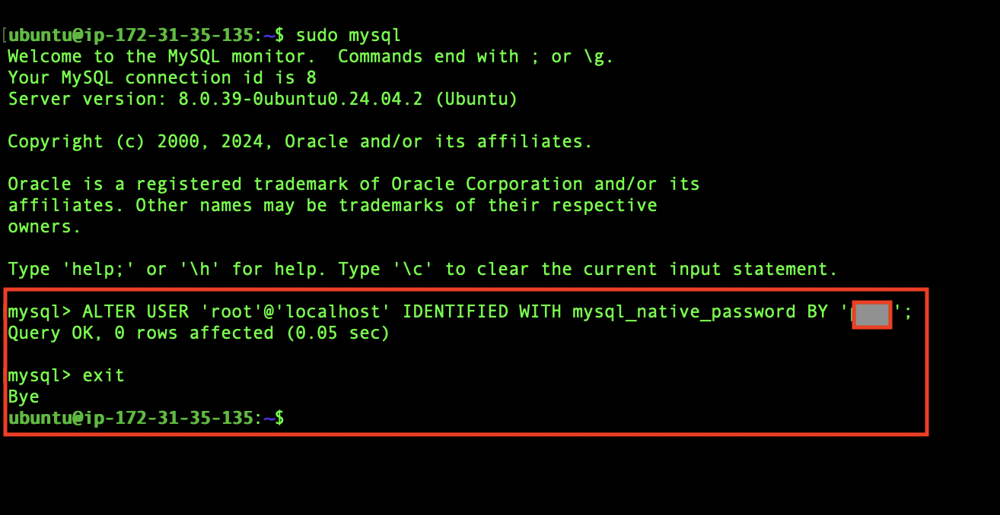

- Start the interactive script by running: `sudo mysql_secure_installation`. Answer y for yes, or any other key to continue without enabling specific options.

- Set your password validation policy level.

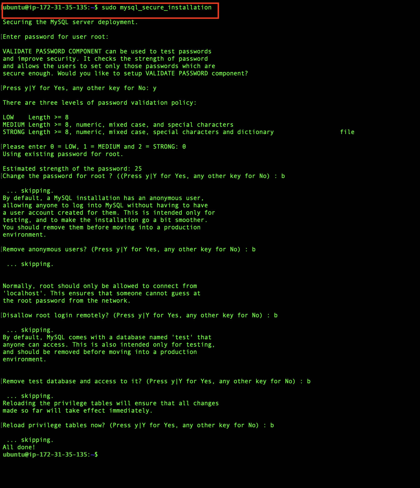

> [!NOTE]
> set my password validation policy level to 0 because I don't require much security, as I will be terminating all resources immediately after this project. However, on the job, it's advised to use the strongest level, which is 2.

- Enable MySQL to start on boot by executing `sudo systemctl enable mysql` then confirm its status with the `sudo systemctl status mysql` command.


---

## Install PHP

Install PHP along with required extensions by running the following script: `sudo apt install php-curl php-gd php-mbstring php-xml php-xmlrpc php-soap php-intl php-zip`

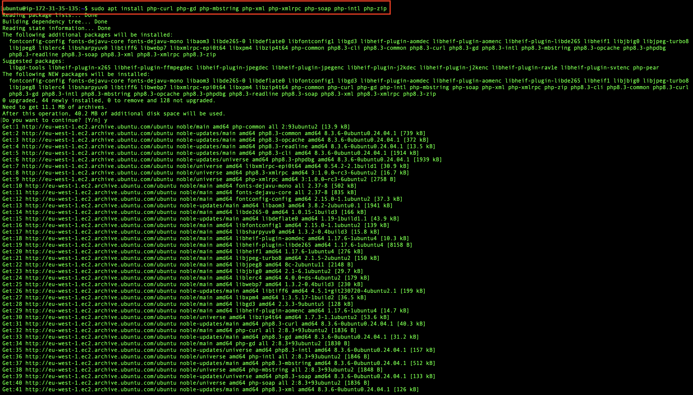

`sudo apt install php libapache2-mod-php php-mysql`


- Check what version of PHP you have installed by running `php -v`


<strong>Creating A Virtual Host For Your Website Using Apache</strong>

- Create the directory for Projectlamp using the 'mkdir' command as follows: `sudo mkdir /var/www/projectlamp` and assign ownership of the directory to our current system user using: `sudo chown -R $USER:$USER /var/www/projectlamp`

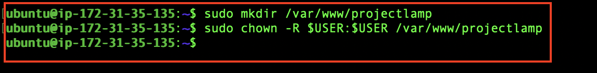

- Create and open a new configuration file in Apache's sites-available directory using your preferred command-line editor: `sudo vi /etc/apache2/sites-available/projectlamp.conf`


- Save your changes by pressing the `Es`c key, then type `:wq` and press `Enter`.

- Run the ls command `sudo ls /etc/apache2/sites-available` to show the new file in the sites-available directory


- Running `sudo a2ensite projectlamp` will enable the new virtual host using the a2ensite command

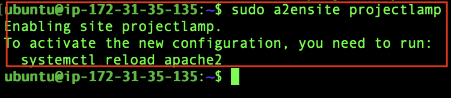

- To disable Apache's default website, use the a2dissite command. Type: `sudo a2dissite 000-default`

- To ensure your configuration file doesn’t contain syntax errors, run: `sudo apache2ctl configtest`. You should see "Syntax OK" in the output if your configuration is correct.

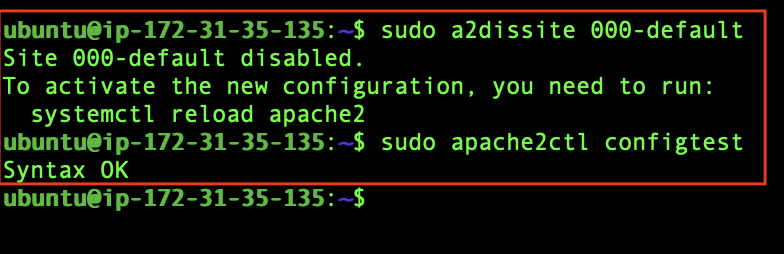

- Reload Apache for the changes to take effect by running `sudo systemctl reload apache2`

- To create the index.html file with the content "Hello LAMP from Etubom" in the /var/www/projectlamp directory, use the following command: `sudo echo 'Hello LAMP from Etubom's computer' > /var/www/projectlamp/index.html`

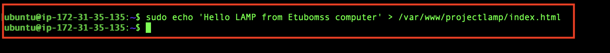

- Go back to your browser and refresh your IPv4 public address to see if your changes come through

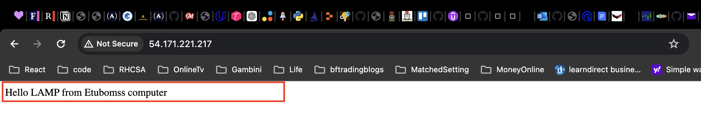

- Remove the index.html file by running the following command: `sudo rm /var/www/projectlamp/index.html`

<strong>Enable PHP On The Website</strong>
With the default DirectoryIndex settings on Apache, a file named index.html will always take precedence over an index.php file. To change the precedence of index files (such as index.php over index.html) in Apache, you'll need to edit the dir.conf file. Here’s how you can do it:

- Use a text editor like nano to edit the dir.conf file: `sudo nano /etc/apache2/mods-enabled/dir.conf`
- Look for the DirectoryIndex directive within this file. It typically looks like this:

```
<IfModule mod_dir.c>
    DirectoryIndex index.html index.cgi index.pl index.php index.xhtml index.htm
</IfModule>
```

- Move index.php to the beginning of the list, like this to change the priority:

```
<IfModule mod_dir.c>
    DirectoryIndex index.php index.html index.cgi index.pl index.xhtml index.htm
</IfModule>

```


- Save changes and reload Apache using `sudo systemctl reload apache2` for the changes to take effect


- To create a new file named index.php inside your custom web root folder (/var/www/projectlamp), you can use the following command to open it in the nano text editor: `nano /var/www/projectlamp/index.php`.

- This will create a new file. Copy and paste the following PHP code into the new file:

```
<?php

phpinfo();

```


- Lets save, close our file and go back to our web broswer page(make sure you do a refresh)


> [!NOTE]
> For security reasons it's best we remove this file as it contains sensitive info about our stack with the knowledge that we can always recreate it if needed.run `sudo rm /var/www/projectlamp/index.php` to remove.

---

## Install Wordpress

Now our LAMP environment has been setup, we can go ahead and install wordpress in our web server root directory: /var/www/html.

- Change directory using the cd command `cd /var/www/html`, and then download the WordPress installation files using the following command: `sudo wget -c http://wordpress.org/latest.tar.gz`


Run `sudo tar -xzvf latest.tar.gz` to extract our downloaded wordpress archive


Run `ls -l` to double check it's there


> [!NOTE]
> The files must be owned by the user of your web server. Identify the web server's user and assign the appropriate permissions accordingly. The user `www-data` is widely adopted as the default user for web server processes, especially on Ubuntu and Debian systems. This user oversees the operation of web server software (like Apache or Nginx) and manages incoming web requests. However, for verification and for tasks involving services that may not have a predefined user, checking the user of the web server is advisable.

- Check the user running your web server with the command: `ps aux | grep apache | grep -v grep`


- Make web server user (www-data) the owner of the WordPress directory and its files by running the command: `sudo chown -R www-data:www-data /var/www/html/wordpress`


<strong>Create a Database For Wordpress</strong>

- Access your MySQL root account with the following command: `sudo mysql -u root -p`. Enter the password you set earlier when prompted.


- We will create a new database for our wordpress app called `wp_db` by running `CREATE DATABASE wp_db;`


-To be able to access our new database,lets create a user and a password for our user running the following command: `CREATE USER edemy@localhost IDENTIFIED BY 'Wp-***********';`


- Lets grant our user priviledge rights by running

```
GRANT ALL PRIVILEGES ON wp_db.* TO edemy@localhost;
FLUSH PRIVILEGES;
```


- We can now exit the MYSQL shell by running `exit` command


- Grant executable permissions recursively (-R) to the wordpress folder using the following command: `sudo chmod -R 777 wordpress/`
- Go into our WordPress directory using `cd wordpress`


<strong>Configure WordPress</strong>
Now our WordPress database has been setup we can no go ahead and setup WordPress.

- Let's rename the sample WordPress configuration file with the command: `mv wp-config-sample.php wp-config.php`
- Edit the wp-config.php file using the command: `sudo nano wp-config.php`


- Update the database settings in the wp-config.php file by replacing placeholders like database_name_here, username_here, and password_here with your actual database details.


- Modify the configuration file projectlamp.conf: `sudo nano /etc/apache2/sites-available/projectlamp.conf` to update the document root to the directory where your WordPress installation is located.


- Update the document root to /var/www/html directory in your editor, save the changes and exit.


- Reload our Apache server using : `sudo systemctl reload apache2` and go back to our browser `http://<EC2 IP>/wordpress/` to finish the installation


- Enter the required information and click on Install WordPress once you have finished.

<table>

<tr>
<td width="40%">S/N</td>
<td width="60%">Project Tasks</td>
</tr>
<tr>
<td>Site Title</td>
<td>name of your wordpress site</td>
</tr>
<tr>
<td>Username</td>
<td>A WordPress username</td>
</tr>
<tr>
<td>Password</td>
<td>Set a strong password</td>
</tr>
<tr>
<td>Your email</td>
<td>An email address</td>
</tr>
<tr>
<td>Search engine visibility</td>
<td>You can leave this box unchecked to prevent search engines from indexing your site until it's ready.</td>
</tr>
</table>


- Log In with your newly created username and password to access your WordPress admin dashboard.


- You should now be able to access your wordpress dashboard


---

## Create An A Record

> [!NOTE]
> Details on how to do this can be read in [Project 1](/project1/README.md)


- Lets update our Apache configuration file sites-available directory to point to our domain name `sudo nano /etc/apache2/sites-available/projectlamp.conf`

- Ensure that the server settings in your Apache configuration point to your domain name, and that the document root accurately points to your WordPress directory. Once you've made these adjustments, save the changes and exit the editor.

```
<VirtualHost *:80>
    ServerName <Your root domain name>
    ServerAlias <Your sub domain name>
    ServerAdmin webmaster@<Your root domain name>

    DocumentRoot /var/www/html/wordpress

    <Directory /var/www/html/wordpress>
        Options Indexes FollowSymLinks
       # AllowOverride All
        Require all granted
    </Directory>

    ErrorLog ${APACHE_LOG_DIR}/error.log
    CustomLog ${APACHE_LOG_DIR}/access.log combined
</VirtualHost>

```


> [!NOTE]
> The new configuration defines how Apache should handle requests for your domain, and its subdomain. With this configuration: Apache will handle requests for edemyoung.online and <a><u>www.edemyoung.online</u></a>. Files will be served from the /var/www/html/wordpress directory. Directory listings and symbolic links are allowed. The directory can be accessed by any client. Error logs will be written to /var/log/apache2/error.log. Access logs will be written to /var/log/apache2/access.log in the combined log format.

- Use the following command: `sudo nano wp-config.php` to update your `wp-config.php` file DNS setting

```
/** MY DNS SETTINGS */
define('WP_HOME', 'http://<domain name>');

define('WP_SITEURL', 'http://<domain name>');
```

- Swap `http://<domain name>` with your actual domain name

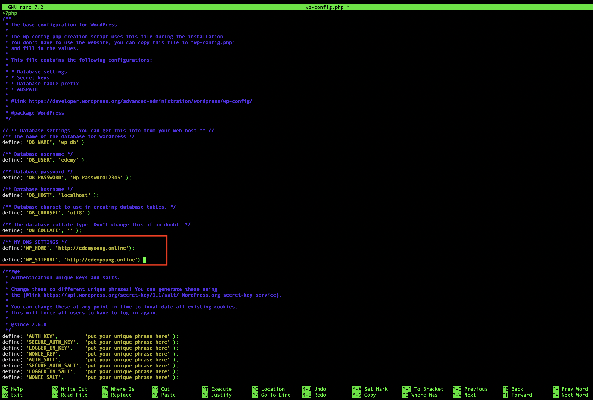

- Reload server `sudo systemctl reload apache2` and check broswer `http://edemyoung.online` to view your Wordpress site

- To log in to your WordPress admin portal, visit http://edemyoung.online/wp-admin, Enter your username and password, then click on log In. Replace with your actual domain name.


Our dashboard without SSL/TLS certificate should look like the image below


---

## Install certbot and Request For an SSL/TLS Certificate

- Install certbot by executing the following commands: `sudo apt update` `sudo apt install certbot python3-certbot-apache`

- Run the command `sudo certbot --apache` to request your SSL/TLS certificate. Follow the instructions provided by Certbot to select the domain name for which you want to enable HTTPS.


Visit your website to confirm, and you'll notice that the "not secure" warning no longer appears, indicating that your site is now secure with HTTPS.


