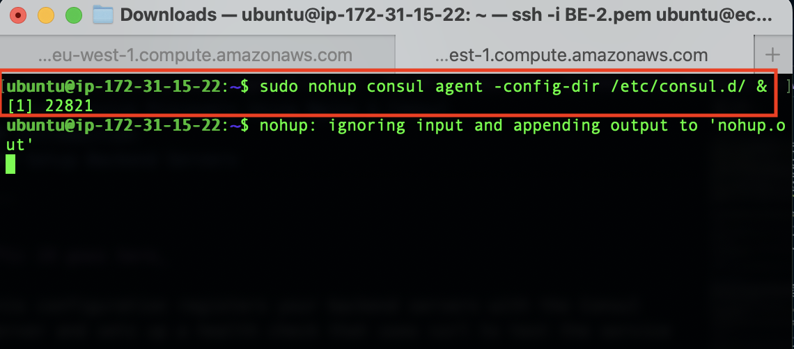

<u>

# Setup Service Discovery Using Nginx & Consul

</u>
In DevOps, service discovery is all about automating how services find each other on a network. It's especially important in modern architectures with microservices, where applications are built from many small, independent services.

Traditionally, services were hardcoded with the locations of other services (like IP addresses). This becomes a nightmare to manage as things change and services are dynamically scaled up or down.

<u>

## Introduction

</u>
This project is focused on service discovery and the tool we will using in our peoject
<table>
<tr>
Key Concepts of Service Discovery
</tr>
<tr>
<td width="20%">S/N</td>
<td width="80%"> 
 
 ### Concepts
</td>
</tr>
<tr>
<td>1</td>
<td>
<strong><em>Service Registration</em></strong> : This involves adding a new service instance to the service registry so that it can be discovered by other services. Each service instance must provide its network location (e.g., IP address and port) and other metadata.
</td>
</tr>
<tr>
<td>2</td>
<td>
<strong><em>Service Registry</em></strong>: This is a database of available service instances. It acts as a central repository where all the service instances are registered and their statuses are monitored. Examples include Consul, Eureka, and etcd.
</td>
</tr>
<tr>
<td>3</td>
<td>
<strong> <em>Service Lookup/Discovery</em></strong>: This is the process by which a service finds the network locations of other services it needs to communicate with. Discovery can be done in several ways:

- _Client-Side Discovery_: The client is responsible for querying the service registry to find an available service instance and then makes a request directly to that instance.
- _Server-Side Discovery_: The client makes a request to a load balancer or API gateway, which queries the service registry and forwards the request to an available service instance.
</td>
</tr>
<tr>
<td>4</td>
<td>
<strong>
<em>
Health Checks</em></strong>: These are used to monitor the health and availability of service instances. Services that fail health checks can be removed from the service registry to ensure that clients do not attempt to communicate with unavailable services.
</td>
</tr>
<table> 
<tr>
<td width="20%">S/N</td>
<td width="80%">

### Benefits of Service Discovery

</td>
</tr>
<tr>
<td>1</td>
<td><strong><em>Dynamic Scalability</em></strong>: As services scale up and down, service discovery ensures that the correct instances are always available.</td>
</tr>
<tr>
<td>2</td>
<td><strong><em>Fault Tolerance</em></strong>: By continually monitoring service health and availability, service discovery helps maintain robust communication between services.</td>
</tr>
<tr>
<td>3</td>
<td><strong><em>Simplified Confirguration</em></strong>: Instead of hardcoding service locations, developers can use the service registry, making configuration simpler and more maintainable.</td>
</tr>
</table>
<table>
<tr>
<td width="20%">S/N</td>
<td width="80%">

### Implementations</td>

</tr>
<tr>
<td>1</td>
<td><strong><em>Consul</em></strong>: A service mesh solution that provides service discovery, health checking, and a distributed key-value store.</td>
</tr>
<tr>
<td>2</td>
<td><strong><em>Eureka</em></strong>: A REST-based service used for locating services for the purpose of load balancing and failover in the cloud, often used with Spring Cloud.</td>
</tr>
<tr>
<td>3</td>
<td><strong><em>etcd</em></strong>: A distributed key-value store that can be used for service discovery, among other things.</td>
</tr>
<tr>
<td>4</td>
<td><strong><em>ZooKeeper</em></strong>: a powerful tool used to implement service discovery in distributed systems, providing essential coordination features such as centralized configuration management, naming services, and distributed synchronization.</td>
</tr>
</table>
</table>

### Example Workflow

- _Service Registration_: When a new service instance starts, it registers itself with the service registry, providing its address and metadata.

- _Health Checks_: The service registry periodically checks the health of registered services.

- _Service Discovery_: When a service needs to communicate with another service, it queries the service registry to find available instances.

- _Load Balancing_: If multiple instances of a service are available, the client or a load balancer can distribute requests among them.

### Use Cases

- _Microservices_: Ensuring that microservices can find each other dynamically as they scale and move across different nodes in a cluster.

- _Dynamic Environments_: In environments where services are frequently added, removed, or updated, service discovery helps maintain seamless communication.

Service discovery is an essential part of modern DevOps practices, enabling the efficient and reliable communication of services in dynamic and scalable environments.

### Consul

Consul is an open-source tool by HashiCorp for service discovery, configuration management, and network automation in distributed systems. It allows services to register and discover each other, performs health checks, and provides a distributed key/value store for configuration data. Consul supports secure service-to-service communication, multi-datacenter setups, and advanced service mesh capabilities, making it ideal for managing microservices and dynamic cloud environments.

<u>

### Key Concepts Covered

</u>

- AWS (EC2 and Route 53)
- Linux(Ubuntu)
- Nginx
- Consul
- Environment Setup
- Service Registration with Consul
- Health Checks and Failover
- Load Balancing
- Monitoring and Logging
- Testing and Validation

<u>

### Project Tasks

</u>

- [x] Task 1: Deploy 4 Ubuntu Server
- [x] Task 2: Allow required ports in the security group
- [x] Task 3: Set up architecture
- [x] Task 4: Setup Consul Server
- [x] Task 5: Setup Backend Servers
- [x] Task 6: Setup Load-Balancer
- [x] Task 7: Validate Service Discovery Setup

<u>

### Documentation

</u>

We can reference [Project 1](../project1/README.md) on how to spin up an Ubuntu server,edit the server names to differentiate them.

- Name your Consul server, LoadBalancer server, and the two backend servers for easy identification.
  

### Allow Required Ports In The Security Group

To ensure the proper functioning of the Consul service, please open the following ports in your security group and apply the same security group to all instances.

### Consul Servers

<table>
<tr>
<td width="25%">

### S/N

</td>
<td width="25%">

### Port Name

</td>
<td width="25%">

### Protocol

</td>
<td width="25%">

### Default Port

</td>
</tr>
<tr>
<td>1</td>
<td>DNS</td>
<td>TCP and UDP</td>
<td>8600</td>
</tr>
<tr>
<td>2</td>
<td>HTTP API</td>
<td>TCP</td>
<td>8500</td>
</tr>
<tr>
<td>3</td>
<td>HTTPS API</td>
<td>TCP</td>
<td>8501</td>
</tr>
<tr>
<td>4</td>
<td>gRPC</td>
<td>TCP</td>
<td>8502</td>
</tr>
<tr>
<td>5</td>
<td>gRPC TLS</td>
<td>TCP</td>
<td>8503</td>
</tr>
<tr>
<td>6</td>
<td>Server RPC</td>
<td>TCP</td>
<td>8300</td>
</tr>
<tr>
<td>7</td>
<td>LAN Serf</td>
<td>TCP and UDP</td>
<td>8301</td>
</tr>
<tr>
<td>8</td>
<td>WAN Serf</td>
<td>TCP and UDP</td>
<td>8302</td>
</tr>
</table>

- Select consul,open it's security group by clicking it's link under security tab
- Edit inbound rules
- Add rule
- create new ports based on the above table and save


> [!NOTE]
> Currently, the ports are being opened manually one at a time. However, in future projects, you'll learn how to automate these tasks, such as creating multiple instances and configuring all the security group rules at once using code. You'll explore this further when you work with Terraform.

### Setup Consul Server

- SSH into the consul server and run sudo apt update to refresh the package cache.
- Visit the consul [downloads](https://developer.hashicorp.com/consul/install) page to copy the installation command.


Run the following comand to install Consul.

```
wget -O- https://apt.releases.hashicorp.com/gpg | sudo gpg --dearmor -o /usr/share/keyrings/hashicorp-archive-keyring.gpg
echo "deb [signed-by=/usr/share/keyrings/hashicorp-archive-keyring.gpg] https://apt.releases.hashicorp.com $(lsb_release -cs) main" | sudo tee /etc/apt/sources.list.d/hashicorp.list
sudo apt update && sudo apt install consul
```


Confirm Consul has been installed by doing a version check `consul --version`


- All the Consul server configurations are located in the `/etc/consul.d` folder. To configure the Consul server, start by backing up the default configuration file `consul.hcl` by renaming it to `consul.hcl.back`, using the following command: `sudo mv /etc/consul.d/consul.hcl /etc/consul.d/consul.hcl.back`

  

  - Generate an encrypted key using the `consul keygen` command.

  

  - Create a new file named `consul.hcl` in the `/etc/consul.d` directory, using the following command: `sudo vi /etc/consul.d/consul.hcl`
  - Add the following content to the `consul.hcl` file, replacing <YOUR_ENCRYPTED_KEY> with the encrypted key you generated:

  ```
  "bind_addr" = "0.0.0.0"
  "client_addr" = "0.0.0.0"
  "data_dir" = "/var/consul"
  "encrypt" = "<YOUR_ENCRYPTED_KEY>"
  "datacenter" = "dc1"
  "ui" = true
  "server" = true
  "log_level" = "INFO"

  ```

  

An explainer of our consul coniguration settings:

1. `bind_addr = "0.0.0.0"`: Specifies the IP address on which Consul will bind to listen for incoming connections. `0.0.0.0` means Consul will listen on all available network interfaces.
2. `client_addr = "0.0.0.0"`: Determines the IP address on which the Consul client API will be available. Setting it to `0.0.0.0` allows connections from any IP address.
3. `data_dir = "/var/consul"`: Specifies the directory where Consul will store its data, such as the state and logs.
4. `encrypt = "<YOUR_ENCRYPTED_KEY>"`: Sets the encryption key for securing communication between Consul servers and clients. Replace this placeholder with your actual generated encryption key.
5. `datacenter = "dc1"`: Defines the datacenter name that this Consul server will use. Consul uses datacenters to organize services and nodes.
6. `ui = true`: Enables the Consul Web UI. This provides a graphical interface for interacting with Consul's data.
7. `server = true`: Indicates that this instance is a Consul server. Server nodes participate in the consensus protocol and store the state of the system.
8. `log_level = "INFO"`: Sets the verbosity of the logs. `INFO` level provides a balance of details, logging general information, warnings, and errors.

---

- Run the following command to start the Consul server in the background: `sudo nohup consul agent -dev -config-dir /etc/consul.d/ &` .
  

> [!NOTE]
> We use the `-dev` flag to indicate that we are running a single Consul server in development mode.

- Run the following command: `consul members` to check status of Consul server.


- If you visit <EC2 Consul Server IP>:8500, you should be able to access the Consul dashboard.

  

> [!NOTE]
> Ensure you replace <EC2 Consul Server IP> with the public IP address of the EC2 instance you're using as the Consul server.

---

### Setup Backend Servers

Since we have the Consul server up and running, let's manage our Nginx backend servers more easily using service discovery. To do this, we'll install Nginx and the Consul agent on all the backend servers. The Consul agent acts like a messenger, automatically registering both the server and the Nginx service running on it with the Consul server, which acts like a central directory.

Apply the configurations below on both backend servers:

- SSH into the backend servers and run `sudo apt-get update -y` to update package information.
  

- Install Nginx on both instances by running the following command: `sudo apt install nginx -y`.


> [!NOTE]
> After installing Nginx, navigate to the default HTML directory and modify the index.html file on both servers to differentiate them.

- run `cd /var/www/html` to navigate to our HTML directory on our nginx server
- run `sudo vi index.html` to edit our index.html file
- Copy the HTML content below into the index.html file. On the second server, replace SERVER-01 with SERVER-02 in the HTML file to differentiate between the two backend servers.

```
<!DOCTYPE html>
<html>
<head>
	<title>Edem's Backend Server </title>
</head>
<body>
	<h1>This is Backend SERVER-01</h1>
</body>
</html>
```

 

- Install Consul as an agent on the servers. Run the following commands to install Consul:

```
wget -O- https://apt.releases.hashicorp.com/gpg | gpg --dearmor | sudo tee /usr/share/keyrings/hashicorp-archive-keyring.gpg

echo "deb [signed-by=/usr/share/keyrings/hashicorp-archive-keyring.gpg] https://apt.releases.hashicorp.com $(lsb_release -cs) main" | sudo tee /etc/apt/sources.list.d/hashicorp.list

sudo apt update && sudo apt install consul
```


Verify that Consul is installed properly by running the following command on both backend servers : `consul --version`.


- Replace the default Consul configuration file config.hcl located in `/etc/consul.d` with your custom `consul.hcl` file.

- Rename the default file and create a new one by running the following commands:

```
sudo mv /etc/consul.d/consul.hcl /etc/consul.d/consul.hcl.back
sudo vi /etc/consul.d/consul.hcl
```

Add the following contents to the file. Replace `<YOUR_ENCRYPTED_KEY>` with your encryption key. Also, replace `34.201.77.72` with your Consul server's IP address.

```
"server" = false
"datacenter" = "dc1"
"data_dir" = "/var/consul"
"encrypt" = "<YOUR_ENCRYPTED_KEY>"
"log_level" = "INFO"
"enable_script_checks" = true
"enable_syslog" = true
"leave_on_terminate" = true
"start_join" = ["34.201.77.72"]
```


<table>
<tr>
<td>
Here's an explanation of the Consul agent configuration settings:
</td>
</tr>
<tr>
<td width="20%">
S/N
</td>
<td width="80%">
Explainer
</td>
</tr>
<tr>
<td>1</td>
<td>

`server = false`: Indicates that this node is not a Consul server, but a client (agent). A Consul server handles requests from other Consul agents, while a client node registers services and performs checks.

</td>
</tr>
<tr>
<td>2</td>
<td>

`datacenter = "dc1"`: Specifies the datacenter name where the Consul agent operates. This should match the datacenter configuration on the Consul server to ensure proper communication.

</td>
</tr>
<tr>
<td>3</td>
<td>

`data_dir = "/var/consul"`: Defines the directory where the Consul agent will store its data files. This directory must be writable by the Consul agent process.</td>

</tr>
<tr>
<td>4</td>
<td>

`encrypt = "<YOUR_ENCRYPTED_KEY>"`: Provides the encryption key for securing communication between Consul agents and the Consul server. Replace <YOUR_ENCRYPTED_KEY> with the actual key generated using consul keygen.</td>

</tr>
<tr>
<td>5</td>
<td>

`log_level = "INFO"`: Sets the verbosity of the log output. INFO level provides a balance between detail and readability, showing general information about Consul operations.</td>

</tr>
<tr>
<td>6</td>
<td>

`enable_script_checks = true`: Enables the execution of script-based health checks. When set to true, the Consul agent can run custom scripts to check service health.

</td>
</tr>
<tr>
<td>7</td>
<td>

`enable_syslog = true`: Allows logging of Consul messages to the syslog service. When enabled, logs will be sent to the system's logging facility, which can be useful for centralized logging and monitoring.

</td>
</tr>
<tr>
<td>8</td>
<td>

`leave_on_terminate = true`: Ensures that the Consul agent will automatically deregister itself from the Consul server when the agent process is terminated. This helps maintain accurate service registration and avoids stale entries.

</td>
</tr>
<tr>
<td>9</td>
<td>

`start_join = ["34.201.77.72"]`: Lists the addresses of Consul servers or agents that this Consul client should contact when starting up to join the Consul cluster. Replace 34.201.77.72 with the IP address of your Consul server. This setting helps the agent locate and connect to the Consul server to begin registering services.</td>

</tr>
</table>

---

- Next, we need to create a `backend.hcl` configuration file in the `/etc/consul.d` directory to register the Nginx service and its health check URLs with the Consul server. This will enable the Consul server to continuously monitor the health of the Nginx service. Use the following command to create and edit the file: `sudo vi /etc/consul.d/backend.hcl`.

- Save the below content in our newly created backend.hcl file

```
"service" = {
  "Name" = "backend"
  "Port" = 80
  "check" = {
    "args" = ["curl", "localhost"]
    "interval" = "3s"
  }
}
```


This configuration registers your backend servers with the Consul server and sets up a health check that uses curl to test the service every 3 seconds.

- Verify the configurations by executing the following command: `consul validate /etc/consul.d`.


- Once all configurations are complete, start the Consul agent with the following command: `sudo nohup consul agent -config-dir /etc/consul.d/ &`.



- To verify if everything is working correctly, visit your Consul UI. If you see the backend listed in the UI as depicted below, it indicates that the backend has successfully registered itself with Consul.
  

  

  

  ***

  ### Setup Load-Balancer

  Next, set up the load balancer to automatically update its backend server information based on the service registry maintained by Consul. To retrieve the backend server details, we will use the consul-template binary. This tool interacts with the Consul server via API calls to fetch the backend server information. It then uses a template to substitute values and generate the loadbalancer.conf file, which is utilized by Nginx.

  - Log in to the load-balancer server. Update the package information and install unzip with the following commands:

  ```

  sudo apt-get update -y
  sudo apt-get install unzip -y
  ```

  

- Install Nginx using the following command: `sudo apt install nginx -y`


- Download the consul-template binary using the following command:

```
sudo curl -L  https://releases.hashicorp.com/consul-template/0.30.0/consul-template_0.30.0_linux_amd64.zip -o /opt/consul-template.zip

sudo unzip /opt/consul-template.zip -d  /usr/local/bin/

```


- To verify the installation of consul-template, check its version with the following command: `consul-template --version`


- Create and edit a file named `load-balancer.conf.ctmpl` in the `/etc/nginx/conf.d` directory, using the following command: `sudo vi /etc/nginx/conf.d/load-balancer.conf.ctmpl`.

- Paste the following content into the file:

```
upstream backend {
 {{- range service "backend" }}
  server {{ .Address }}:{{ .Port }};
 {{- end }}
}

server {
   listen 80;

   location / {
      proxy_pass http://backend;
   }
}
```


### Here's a breakdown of the configuration:

1. Upstream Block

```

upstream backend {
 {{- range service "backend" }}
  server {{ .Address }}:{{ .Port }};
 {{- end }}
}

```

- upstream backend: This defines a group of backend servers that Nginx can load-balance requests across.
- {{- range service "backend" }}: This is a Consul-Template directive that iterates over all services registered with Consul under the name "backend".
- server {{ .Address }}:{{ .Port }};: For each backend service, it adds an entry to the upstream block with the server's address and port.
- {{- end }}: Ends the iteration block.

2. Server Block

```
server {
   listen 80;

   location / {
      proxy_pass http://backend;
   }
}

```

- server: Defines a virtual server that listens for incoming requests.
- listen 80: Specifies that this server block will listen on port 80 (the default HTTP port).
- location /: Defines a location block for all requests to the root URL (/).
- proxy_pass http://backend: Forwards incoming requests to the upstream group named "backend" defined above. Nginx will use the addresses and ports listed in the upstream backend block to balance the requests.

> [!NOTE]
> This setup keeps Nginx's backend server list in sync with Consul's. It ensures that Nginx always routes traffic to the currently available backend servers.

---

- Create a file named `consul-template.hcl` in the `/etc/nginx/conf.d/` directory. This configuration file is used by consul-template to specify details about the Consul server IP and the destination path where the processed load-balancer.conf file will be saved.

run the following command to create && edit the file `sudo vi /etc/nginx/conf.d/consul-template.hcl`.

- Add the following content to the file, replacing `<Consul Server IP>` with your Consul server's IP address. This configuration specifies the Consul server details, the path to the template file, the destination for the rendered Nginx configuration, and the command to reload Nginx after updating the configuration.

```
consul {
 address = "<Consul Server IP>:8500"

 retry {
   enabled  = true
   attempts = 12
   backoff  = "250ms"
 }
}
template {
 source      = "/etc/nginx/conf.d/load-balancer.conf.ctmpl"
 destination = "/etc/nginx/conf.d/load-balancer.conf"
 perms       = 0600
 command = "service nginx reload"
}
```


- Delete the default server configuration to disable it by running the following command: `sudo rm /etc/nginx/sites-enabled/default`.

1[](./img/31.png)

The default server configuration file should be deleted to avoid inconsistencies with the server's settings.

- Restart Nginx to apply the changes by running the following command: sudo systemctl restart nginx.

- Once configurations are complete, start the Consul Template agent using the following command. It continuously monitors Consul for changes.

`sudo nohup consul-template -config=/etc/nginx/conf.d/consul-template.hcl &`


- Upon completion, a load-balancer.conf file will be created with backend server information populated from the Consul service registry.


Now, if you access the load balancer IP in your web browser, it will display the custom HTML content from one of the backend servers. When you refresh the page, the load balancer will route your request to the other backend server, displaying its custom HTML content.


---

### Service Discovery Test

- Now that everything is set up and running, you can test the configuration by observing what happens when you stop one of your backend servers.

run `sudo systemctl stop nginx` on one of our backend servers


As a result, the load balancer will only direct traffic to the remaining healthy backend servers. This ensures that your application continues to run smoothly without any disruption to users, demonstrating the effectiveness of your service discovery and health check configuration with Consul and Nginx.

run `sudo systemctl start nginx` to restart the server and see it status get updated on consul


Service Check: These checks are specific to the services running on the nodes (in this case, Nginx). When you stopped Nginx, the service check that monitors the health of Nginx on that particular node would fail, leading to the "all service checks failed" error.

Node checks: These checks monitor the overall health of the node itself, which includes the underlying operating system and possibly other metrics (like CPU, memory, and disk usage). Since stopping Nginx does not necessarily mean the node is unhealthy (the node could still be up and running, responding to pings, etc.), the node checks would still pass.

---

<strong>Project 5 End </strong>
